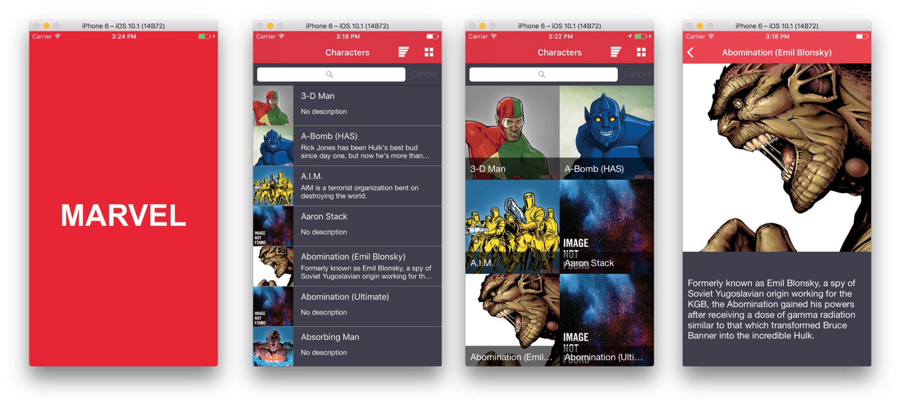

# Marvel App

[](https://twitter.com/tplioy)
[](https://github.com/thiagolioy/marvelapp/blob/master/LICENSE)
[](https://travis-ci.org/thiagolioy/marvelapp)
[](https://github.com/thiagolioy/marvelapp/network)
[](https://github.com/thiagolioy/marvelapp/stargazers)
[](https://github.com/thiagolioy/marvelapp/issues)

-------
<p align="center">
    <a href="#appearance">Appearance</a> &bull;
    <a href="#motivation">Motivation</a> &bull;
    <a href="#posts">Posts</a> &bull;
    <a href="#installation">Installation</a>
</p>
-------

## Appearance

<h3 align="center">
  
</h3>

## Motivation

This repository supports a series of posts that will show how to create an iOS app from scratch, using many different pods and tools that will make your life easier. The project will have Marvel's theme and use its [API](https://developer.marvel.com). You can usually find this information elsewhere but it is usually splitted in different unrelated tutorials, my approach here is to convey all within a single project


## Posts

Creating a Marvel iOS App from scratch..

- [Part 1 | Tools, pods, tricks of the trade and more](https://medium.com/cocoaacademymag/creating-a-ios-app-from-scratch-tools-pods-tricks-of-the-trade-and-more-part-1-a0a3f18fbd13#.fu8u4puxu)
- [Part 2 | Tests, coverage and more](https://medium.com/cocoaacademymag/creating-a-ios-app-from-scratch-part-2-tests-coverage-and-more-73b94178b695#.4s4omxm48)
- [Part 3 | Travis, Danger and Fastlane](https://medium.com/cocoaacademymag/creating-a-ios-app-from-scratch-part-3-travis-danger-and-fastlane-8ac91a003c95#.ii2fy9oc5)
- [Part 4 | Sketch for developers](https://medium.com/cocoaacademymag/creating-a-marvel-ios-app-from-scratch-part-4-sketch-for-developers-2344a221482a#.kr3lhhobz)

Other posts built upon Marvel's iOS App..

- [Migrating a Marvel's App to view code!](https://medium.com/cocoaacademymag/migrating-an-app-to-view-code-ffe3f1510408#.jwzemxaqa)
- [Testing Marvel's View Code project .. With 100 % Code coverage !!](https://medium.com/cocoaacademymag/testing-marvels-view-code-project-with-100-code-coverage-23c55de4053b#.j16lslb7k)

- [Marvel iOS App! Favoriting a character with View Code, Realm & RxSwift ..](https://medium.com/cocoaacademymag/marvel-ios-app-favoriting-a-character-with-view-code-realm-rxswift-e43b187c0f8e#.dd6bmjkil)

- [Architecture Thoughts: Migrating Marvel's iOS App to ReSwift](https://medium.com/cocoaacademymag/architecture-thoughts-migrating-marvels-ios-app-to-reswift-ef7f20e84e60#.nl0b3aizp)


## Installation

This project uses [Bundler](http://bundler.io) and [CocoaPods](https://cocoapods.org). All you need to setup it properly is:
```
bundle
bundle exec pod install
```

## Tests And Coverage

You can run the tests any time. All your need to do is:
```
bundle exec fastlane test
```

## License
This project is licensed under the terms of the MIT license. See the LICENSE file.
